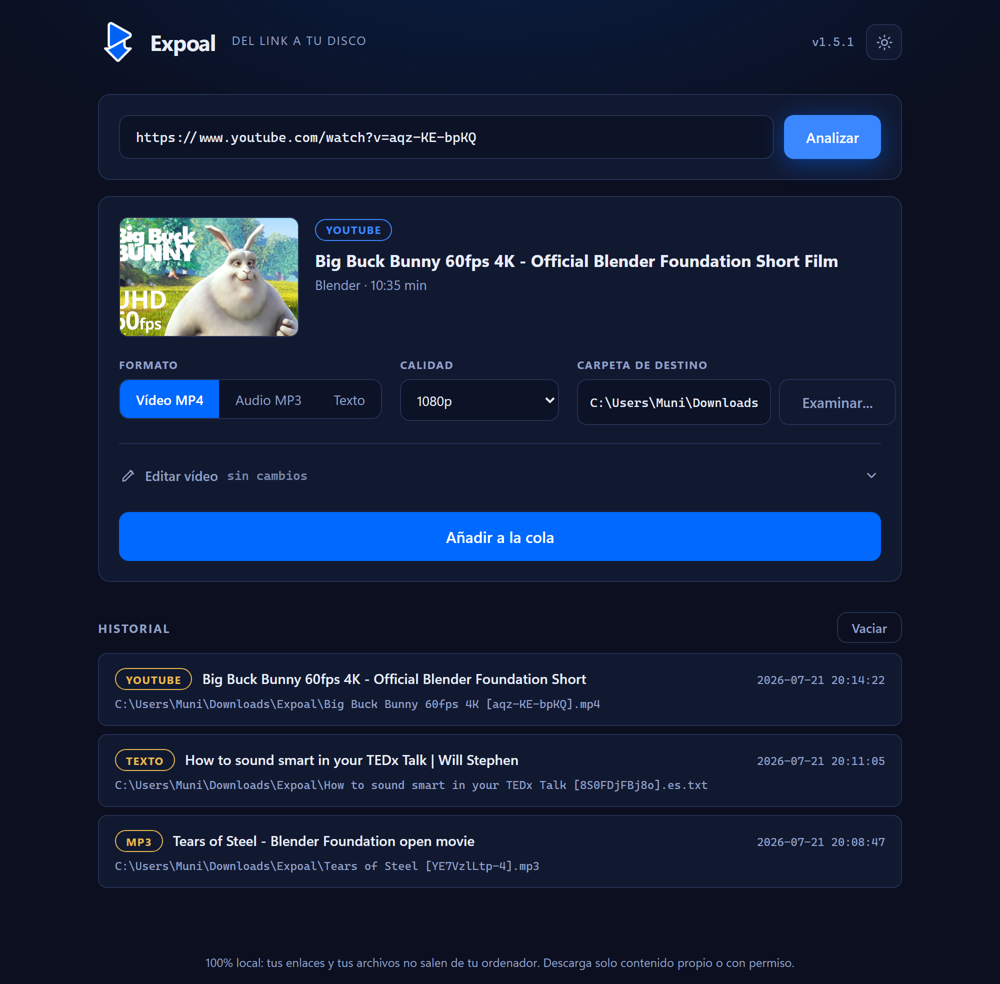

<div align="center">


# Expoal

**Paste a link from YouTube, TikTok or Instagram and get the video saved on your own disk.**

No third-party download sites, no ads, no uploads. Everything runs locally on your machine, powered by [yt-dlp](https://github.com/yt-dlp/yt-dlp).

### One-click download

[](https://github.com/Mun1to/Expoal/releases/latest/download/Expoal-setup.exe)
[](https://github.com/Mun1to/Expoal/releases/latest/download/Expoal-linux-x86_64.AppImage)

[](https://github.com/Mun1to/Expoal/releases/latest)
[](LICENSE)
[](https://mun1to.github.io/Expoal/)

[**Website**](https://mun1to.github.io/Expoal/) · [**All downloads**](https://github.com/Mun1to/Expoal/releases/latest)



</div>

## Features

- Paste a link, preview the video and download it in the best available quality
- Choose the format: MP4 video, MP3 audio (requires FFmpeg) or the video's text
- Extract the transcript: save subtitles as clean text or as timed `.srt`, in any of the languages the video offers, either instead of the video or alongside it
- Pick the resolution, and choose the destination folder with a native file browser
- Edit while you download: trim the length (visual slider or exact timecodes), crop the edges by pixels, and strip the audio track
- Download queue with live progress, speed and ETA
- Persistent download history
- Light and dark theme with a toggle (remembers your choice, follows the system by default)
- One-click self-update on Windows and Linux: the app checks GitHub on startup and updates itself when a new version is out
- Runs on Windows (native window) and Linux (AppImage, opens in your browser)
- Two ways to use it, same app:
  - Web mode: a local page in your browser
  - Desktop mode: a native window you can pin to the taskbar
- 100% local and private: the server only listens on 127.0.0.1, and your links and files never leave your computer

## Download

Grab the latest build from the [**releases page**](https://github.com/Mun1to/Expoal/releases/latest).

**Windows**

- **`Expoal-<version>-setup.exe` (installer, recommended)** — a normal Windows setup wizard. It installs the app, adds Start menu (and optionally desktop) shortcuts, and registers an uninstaller in "Add or remove programs". No admin rights needed.
- **`Expoal-windows.zip` (portable)** — unzip anywhere and run `Expoal.exe`, nothing to install.

Double-clicking opens the app in its own window, which you can then pin to the taskbar.

**Linux**

- **`Expoal-<version>-x86_64.AppImage`** — a single file that runs on any distro:
  ```bash
  chmod +x Expoal-*-x86_64.AppImage
  ./Expoal-*-x86_64.AppImage
  ```
  It opens Expoal in your browser (still 100% local, the server only listens on 127.0.0.1).

Everything (Python and all dependencies) is bundled on both platforms.

Once installed, Expoal checks for a newer release on startup. When one is available, a banner appears and a single click downloads and installs it (the download is verified against the release checksums).

> FFmpeg is not bundled (it is large). Install it for MP3 export and top-quality merges:
> `winget install Gyan.FFmpeg`

### "Windows protected your PC"

The `.exe` is not signed with a paid code-signing certificate, so the first time you run it
Windows SmartScreen may show a blue **"Windows protected your PC"** screen listing the publisher
as unknown. This is expected for independent open-source apps. To run it:

1. Click **More info**.
2. Click **Run anyway**.

You only need to do this once. The full source is in this repo if you prefer to build it yourself.

## Run from source

Requirements: Python 3.10+ and [uv](https://docs.astral.sh/uv/).

```bash
git clone https://github.com/Mun1to/Expoal.git
cd Expoal
uv sync

# Web mode: opens http://127.0.0.1:8710 in your browser
uv run expoal

# Desktop mode: opens a native window
uv run expoal --desktop
```

Options: `--port <n>` to change the web port, `--no-browser` to skip opening the browser.

### Build the standalone app yourself

```powershell
uv run pyinstaller --noconfirm --windowed --name Expoal --icon assets\expoal.ico --add-data "src\expoal\web;expoal\web" launcher.py
```

The result is in `dist\Expoal\Expoal.exe`. To build the installer as well (requires [Inno Setup 6](https://jrsoftware.org/isdl.php)):

```powershell
& "$env:LOCALAPPDATA\Programs\Inno Setup 6\ISCC.exe" installer\expoal.iss
```

This produces `dist\Expoal-<version>-setup.exe`.

## Releasing a new version

Releases are built and published automatically. To ship a new version:

1. Bump `version` in `pyproject.toml` and `__version__` in `src/expoal/__init__.py`.
2. Commit, then push a matching tag:
   ```bash
   git tag v1.2.0 && git push origin v1.2.0
   ```

The [release workflow](.github/workflows/release.yml) then builds the `.exe` and the installer on Windows, generates `SHA256SUMS.txt`, and publishes the GitHub release with all the assets. Users on an older version get the in-app update banner automatically.

## How it works

A small FastAPI server wraps yt-dlp and exposes a minimal API (`/api/info`, `/api/download`, `/api/pick-folder`, `/api/jobs`, `/api/history`). The same static web UI is served in your browser (web mode) or inside a pywebview native window (desktop mode). A local-origin guard blocks cross-origin requests, so no other site can talk to the server. Downloads run in a background queue, one at a time, and the history is stored as JSON in your user data folder.

## Legal notice

Download only content you own, content licensed for it, or content you have permission to save. Downloading media may violate the terms of service of some platforms. This tool is intended for personal archiving. You are responsible for how you use it.

## Brand

Logo, colors and tone are documented in [docs/MARCA.md](docs/MARCA.md). Icons are generated from the
source logo with `uv run python scripts/make_brand.py`.

## License

[MIT](LICENSE) © 2026 Munir Torres (Mun1to)
